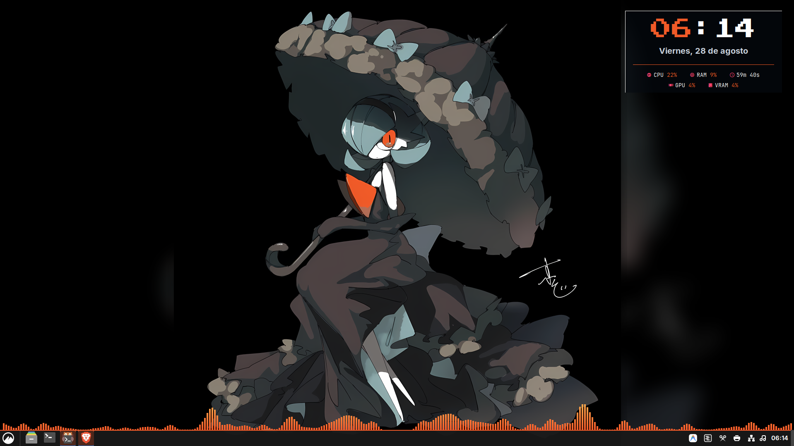
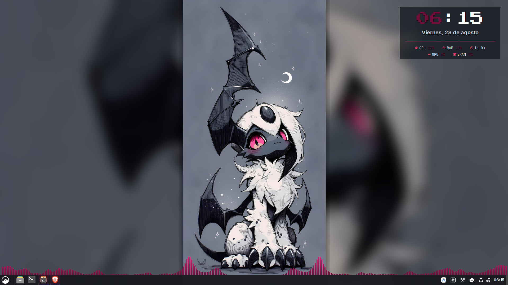
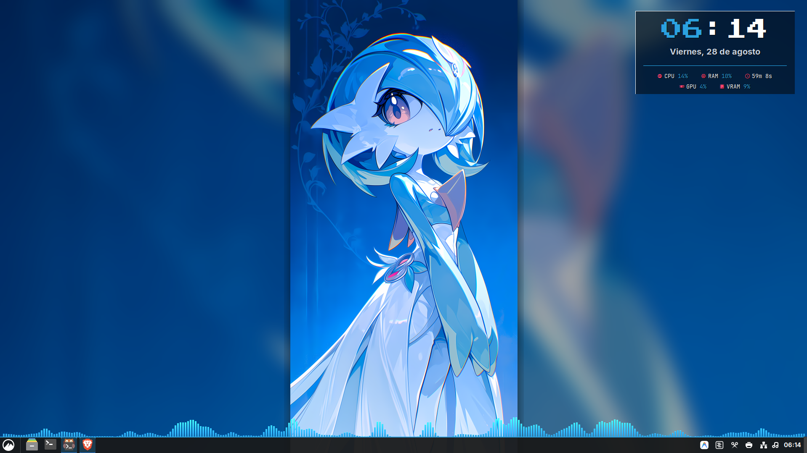
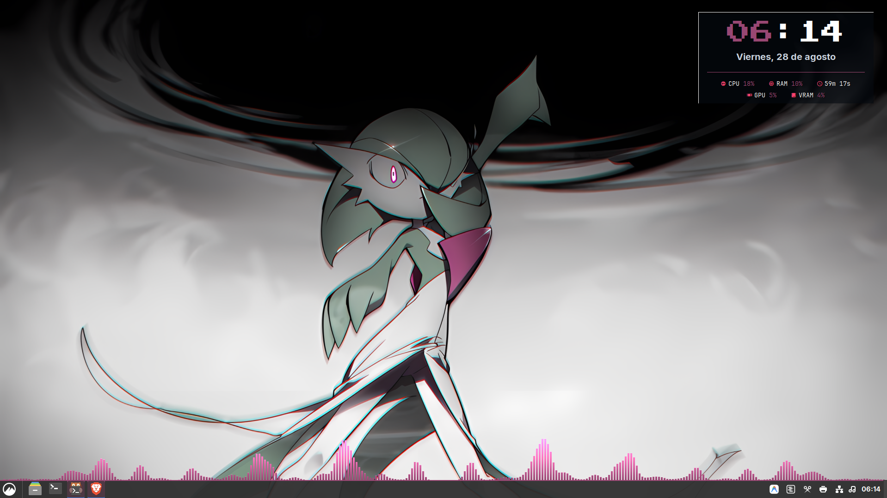

# 🌸 Gardevoir Dynamic Arch Setup

Un entorno de trabajo completo para **Arch Linux + Cinnamon**, optimizado para desarrollo, robótica (**ROS 2 Jazzy**) y control **100% por teclado**.

## Características Principales
* **Tema Dinámico Gardevoir:** La barra de tareas, bordes de Rofi y luces RGB (OpenRGB) se adaptan automáticamente a los colores de cada fondo de pantalla en 4K.
* **Flujo 100% Teclado:**
  * `Win + Espacio` -> Rofi Spotlight
  * `Win + Tab` -> Buscador de Ventanas en Cualquier Monitor
  * `Win + X` -> Menú de Energía (Apagar/Reiniciar)
  * `Win + /` -> Panel Flotante de Atajos
  * `Win + G` -> Siguiente Fondo de Pantalla + Sincronización RGB
  * `Win + Enter` -> Terminal Kitty con Pokémon
* **Audio Dinámico (GLava):** Visualizador de ondas en tiempo real sobre la barra de tareas.
* **Entorno Robótica (ROS 2 Jazzy):** Contenedor Ubuntu 24.04 con aceleración NVIDIA y RViz2.
* **Herramientas Rápidas:** Visor `Viewnior` (sprites Godot), `Zathura` (PDFs modo oscuro) y `Yazi` (explorador 4K).
* **Historial de Portapapeles:** `Win + V` abre CopyQ de forma estable (script `copyq-toggle.sh`).

## Instalación en una nueva máquina (Laptop / PC)
```bash
git clone git@github.com:Patini789/ARCH-Linux-config.git ~/dotfiles
cd ~/dotfiles
./install.sh
```

> El repo es privado. Necesitas acceso autenticado (SSH o token).
> Piezas externas que `install.sh` **no** instala (hacer manualmente):
> - Theme de web-greeter `gardevoir-shiny` en `/usr/share/web-greeter/themes`
> - Sonidos de Pokémon en `~/.local/share/sounds/pokemon/*.ogg | *.wav`
> - Theme de iconos `Papirus-Dark`

## Capturas








